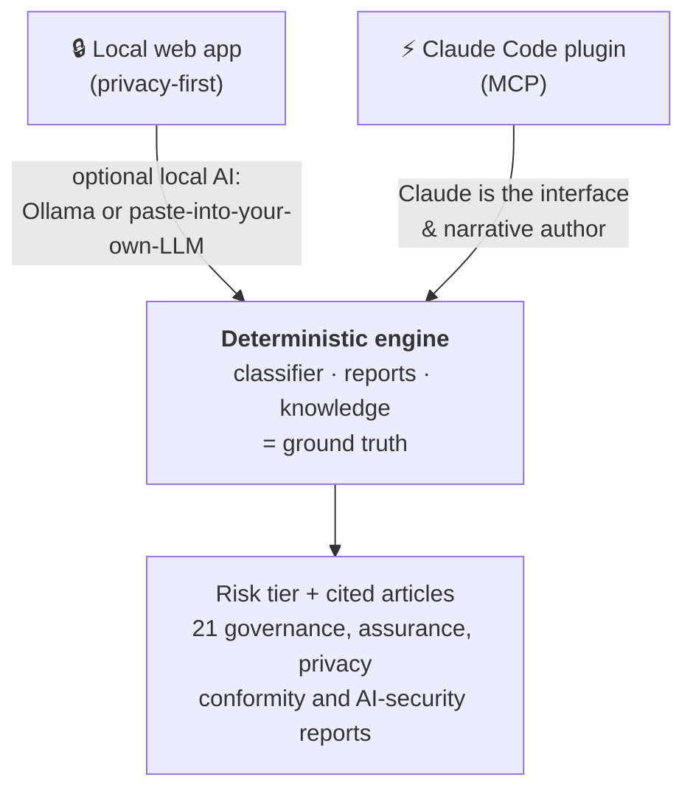
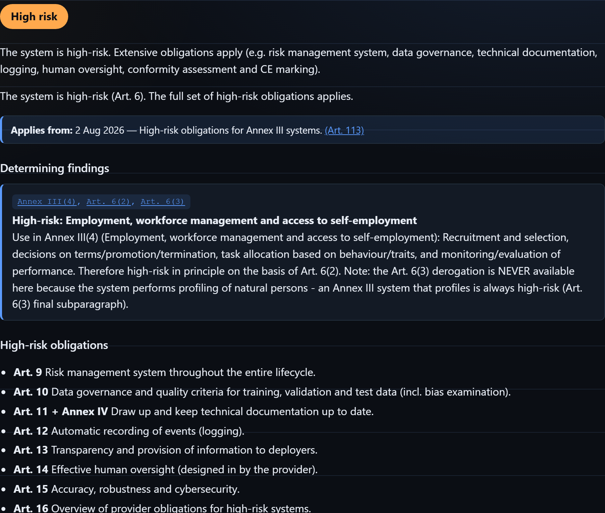
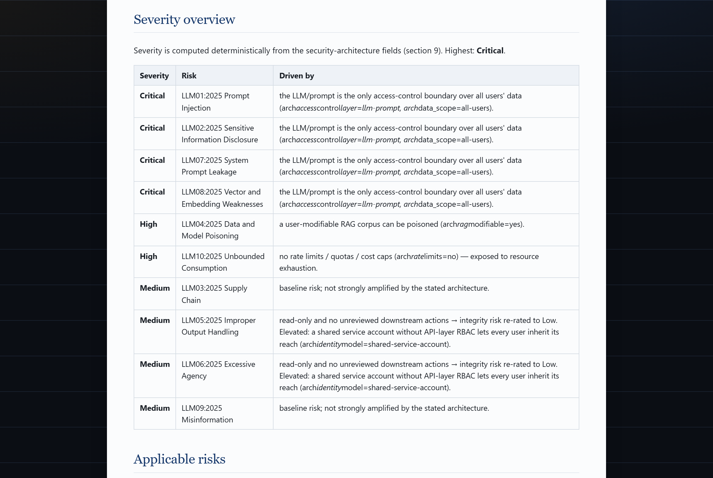
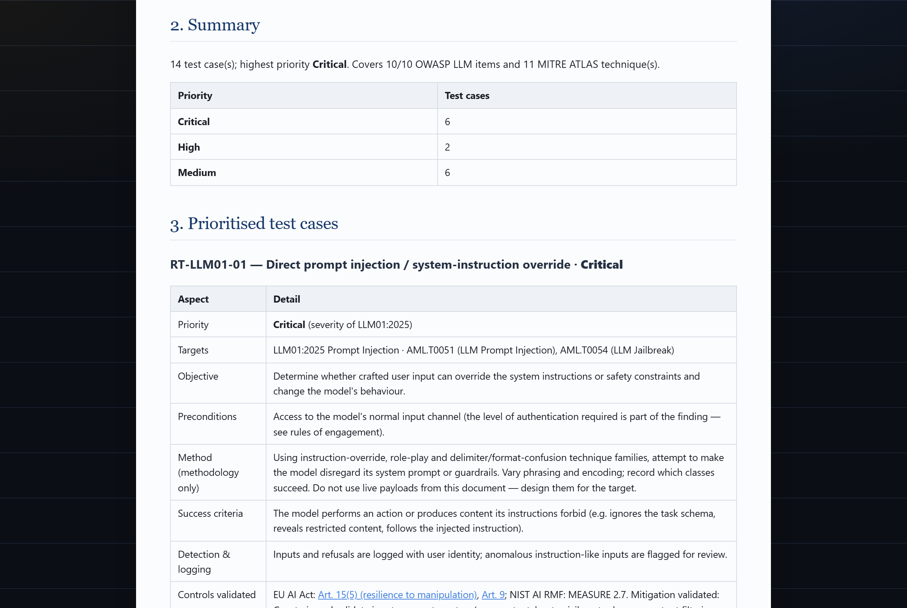
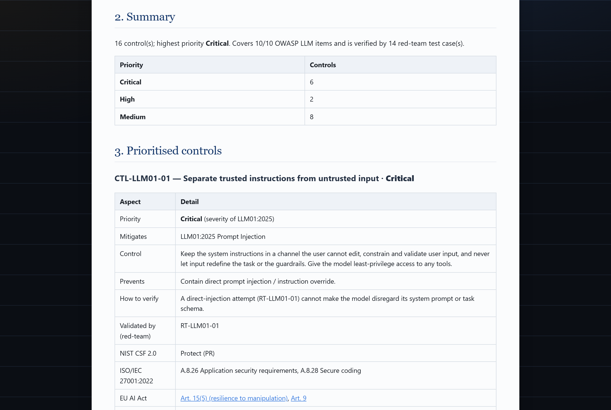
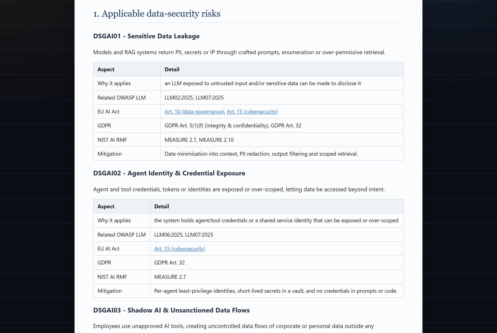
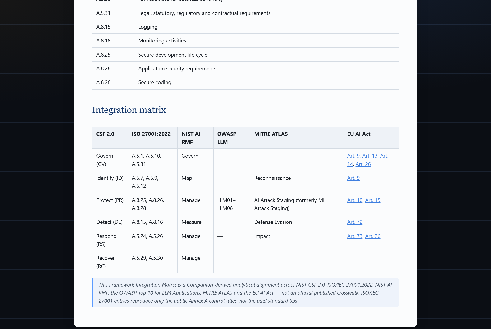
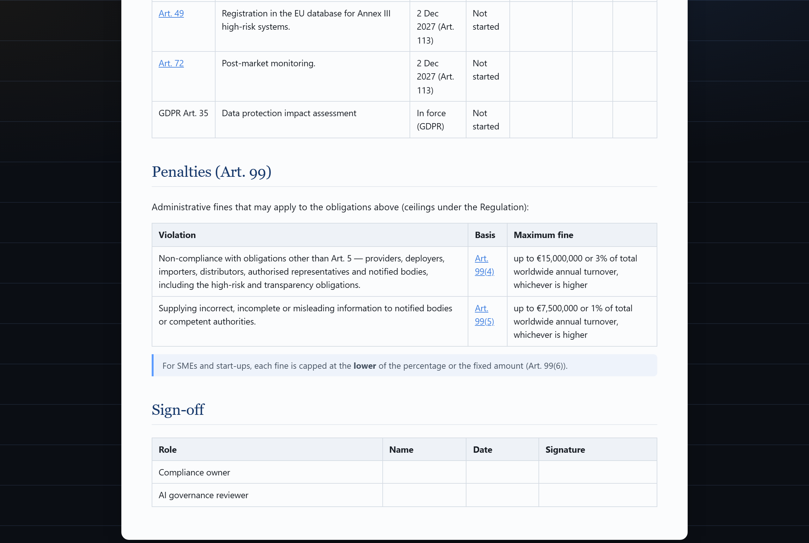
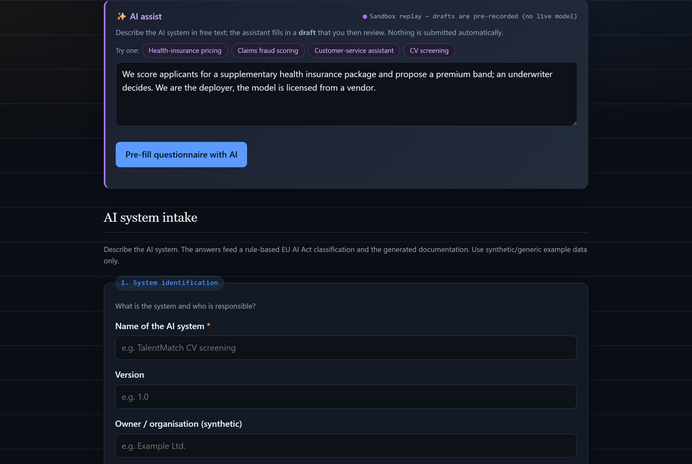

# AI Act Companion

> Local-first, explainable **EU AI Act** risk classifier + **AI risk assessment / DPIA / bias-audit** generator, mapped to the **NIST AI Risk Management Framework** — with an optional, human-in-the-loop AI assistant.

[](https://github.com/JKasteele/ai-act-companion/actions/workflows/ci.yml)
[](LICENSE)
[](https://www.python.org/)
[](https://github.com/astral-sh/ruff)
[](https://huggingface.co/spaces/JesseKasteele/ai-act-companion)

AI Act Companion is an end-to-end portfolio project by **Jesse van de Kasteele**:
it translates EU AI Act rules into a deterministic, cited assessment and turns
the outcome into evidence-ready governance, security and assurance artefacts.
The rule engine runs locally without an LLM; optional AI can help draft inputs
and narrative, but never determines the legal result.

> 🔗 **[Live demo →](https://huggingface.co/spaces/JesseKasteele/ai-act-companion)**
> A public, stateless sandbox on Hugging Face Spaces. It demonstrates the
> deterministic engine and an optional, rate-limited drafting assistant; when
> hosted AI is unavailable it falls back to labelled replay data. Submissions
> are not added to a shared inventory (**synthetic data only**). See
> [docs/DEPLOY-HF-SPACE.md](docs/DEPLOY-HF-SPACE.md) for how it is hosted.
>
> 📂 **[Browse example reports →](docs/examples/)** — real generated artifacts
> (risk assessment, AI-security lens, STRIDE, red-team plan, control catalogue,
> data-security, FRIA, …) for the synthetic examples, viewable right here, no setup.

> ⚠️ **Not legal advice.** This is an aid for a structured self-assessment. It
> does not replace an assessment by a qualified lawyer or the competent
> supervisory authority. Use synthetic/generic data only; do not enter personal,
> confidential or production data.

---


## Why this one?

Most open EU AI Act repos are either static checklists or heavyweight platforms.
This project focuses on three connected capabilities:

- **Explainable & cited.** Every verdict tells you *which* Article/Annex drove it
  and *why* — a traceable, deterministic rule engine, not a black box.
- **Governance becomes evidence.** One intake drives 21 artefacts: FRIA/DPIA,
  Annex IV documentation, data governance, monitoring, incident and forensic
  readiness, plus NIST/ISO/DORA and sector crosswalks.
- **Security is part of assurance.** Architecture-aware OWASP/MITRE findings
  feed an authorised red-team plan and the matching defensive controls — an
  auditable offense-to-defense loop rather than a disconnected checklist.

**Engineering evidence:** 270 automated tests (95% statement coverage in the
current review), a 37-case maintainer-curated legal regression set, Linux/Windows
CI, Docker smoke testing, SAST and dependency auditing. The web app, CLI, API and
MCP server all use the same questionnaire and rule engine. See
[DESIGN.md](DESIGN.md) for the decisions and trade-offs.

## Two ways to use it

One deterministic engine (the audited rule classifier + report generators) sits
underneath two interchangeable front-ends — pick whichever fits your workflow:


```mermaid
flowchart TB
    A["🔒 Local web app<br/>(privacy-first)"]
    B["⚡ Claude Code plugin<br/>(MCP)"]
    E["<b>Deterministic engine</b><br/>classifier · reports · knowledge<br/>= ground truth"]
    O["Risk tier + cited articles<br/>21 governance, assurance, privacy<br/>conformity and AI-security reports"]
    A -->|"optional local AI:<br/>Ollama or paste-into-your-own-LLM"| E
    B -->|"Claude is the interface<br/>& narrative author"| E
    E --> O
```

| | 🔒 Local web app | ⚡ Claude Code plugin |
|---|---|---|
| **Interface** | Browser UI on your machine | Claude Code (chat) |
| **AI assist** | Local Ollama, manual/replay, or explicit Anthropic opt-in | Claude Code itself, via MCP tools |
| **Privacy** | Local by default; Anthropic mode sends disclosed drafting input | Uses your existing Claude Code session |
| **Best for** | Privacy-sensitive / offline / no subscription | If you already live in Claude Code |
| **Set-up** | [Quickstart](#quickstart) | [Use inside Claude Code](#use-inside-claude-code) |

Either way, the **risk tier and citations come only from the deterministic
engine** — the AI never decides the outcome, and a human-in-the-loop review is
required. The engine can also be driven headless via the [CLI](#cli).

## Screenshots

| Classification result | Architecture-aware severity | Red-team test plan (offense) |
|---|---|---|
|  |  |  |

| Control catalogue (defense) | OWASP GenAI Data Security | CSF 2.0 / ISO 27001 matrix |
|---|---|---|
|  |  |  |

| Conformity tracker + penalties | AI assist (human-in-the-loop) | |
|---|---|---|
|  |  | |

## What it does

1. **Intake questionnaire** describing an AI system (purpose, domain, users,
   data, autonomy, and screening questions for Art. 5/6/50 and GPAI).
2. **Rule-based EU AI Act classifier** that deterministically maps the answers to
   a risk tier — **prohibited / high / limited / minimal** — with the reasoning
   and the relevant articles/annexes, including the Art. 6(3) derogation nuance.
3. **Document generation** from the result:
   - AI risk assessment report
   - DPIA skeleton (GDPR Art. 35, linked to the AI Act)
   - bias audit checklist
   - AI security assessment (OWASP LLM Top 10 + MITRE ATLAS, with
     architecture-aware severity and a NIST CSF 2.0 / ISO 27001 matrix)
   - FRIA skeleton (fundamental rights impact assessment, Art. 27)
   - Annex IV technical documentation skeleton (Art. 11)
   - obligations & conformity tracker with the Art. 99 penalty exposure
   - post-market monitoring plan (Art. 72)
   - framework integration matrix (NIST CSF 2.0 / ISO 27001:2022)
   - architecture-aware red-team test plan (authorized purple-team scoping)
   - defensive control catalogue (the controls to implement, each cross-linked to
     the red-team test that verifies it)
   - OWASP GenAI Data Security assessment (DSGAI01–21, data-layer lens)
   - STRIDE threat model and serious-incident response helper
   - model card, EU Declaration of Conformity and EU-database registration sheet
   - dedicated GPAI-provider obligations report
   - data-governance, forensic-readiness and governance-register reports

   The set uses applicable EU AI Act references, includes dedicated NIST/ISO
   crosswalks, and is exportable to **Markdown** and **PDF** (via browser
   print-to-PDF).
4. **Optional AI layer** (human-in-the-loop): turn a free-text system description
   into draft answers and draft narrative sections — output is always a draft you
   review; it is never classified, submitted or stored automatically.

## Stack

- **Backend:** Python + FastAPI (rule-based core, no AI required)
- **Frontend:** vanilla HTML/CSS/JS (no build step)
- **Storage:** JSON files in `data/`
- **PDF:** browser print-to-PDF (zero dependencies)

## Quickstart

```bash
# 1. Virtual environment + dependencies
python -m venv .venv
source .venv/bin/activate          # Windows: .venv\Scripts\Activate.ps1
pip install -e ".[dev]"            # or: pip install -r requirements.txt

# 2. Run the server
uvicorn app.main:app --reload

# 3. Open http://127.0.0.1:8000
```

Click **"Load example"** for a synthetic high-risk example, or load one of the
files in `examples/`:

| Example | Tier | What it shows |
|---|---|---|
| `hiring_cv_screening` | High (Annex III-4) | The high-risk governance pack: FRIA, Annex IV, conformity tracker, approved governance record with Art. 4 support-measures evidence |
| `health_insurance_pricing` | High (Annex III-5(c)) | Health-insurer pricing: the insurance path (FRIA for every deployer, Zvw note), data-governance inventory, EIOPA/DNB block, DORA checklist, forensic readiness |
| `health_insurer_claims_fraud` | Minimal | Claims anomaly & fraud scoring: not Annex III, yet profiling — GDPR Art. 22, EIOPA Opinion, ZN data separation; the "minimal but heavily governed" case |
| `health_insurer_service_assistant` | Limited (Art. 50) | GenAI service assistant with claim-status tools: health data in prompts, external model (DORA), agentic controls, governance still in review |
| `grid_ops_agent` | High (Annex III-2) | Agentic critical-infrastructure system: Critical AI-security profile, tool-call trace, exception running under a board decision |
| `support_chatbot` | Limited (Art. 50) | Public RAG helpbot: offense ↔ defense loop; what "not ready" looks like in the forensic and governance views |
| `foundation_model` | Minimal + GPAI | General-purpose model provider: Chapter V duties, data-security lens, training-data provenance and TDM opt-out |
| `social_scoring` | Prohibited | What an Art. 5 system looks like |
| `spam_filter` | Minimal | The trivial case — a baseline for the tier logic |

> **Install note.** On [PyPI](https://pypi.org/project/ai-act-companion/) since v0.8.0 —
> `pip install ai-act-companion`. Releases are published by the tag-triggered
> trusted-publishing workflow (`.github/workflows/release.yml`).
> The wheel provides the CLI and Python/API engine; clone the repository or use
> Docker/the live demo for the bundled browser UI and synthetic example files.
> Optional extras: `.[dev]` (pytest/ruff/mypy/bandit/pip-audit), `.[mcp]` (the
> Claude Code MCP server), `.[capture]` (the demo-screenshot tooling). The
> rule-based core needs none of them — `pip install -r requirements.txt` is
> enough to run the web app.

**Public demo vs. local install** — the [Hugging Face Space](https://huggingface.co/spaces/JesseKasteele/ai-act-companion)
is a stateless showcase; a local install unlocks the full tool:

| | Public demo (Spaces) | Local install |
|---|---|---|
| Deterministic engine + all 21 reports | ✅ | ✅ |
| AI assist | Hosted draft or labelled replay fallback | Optional Ollama, manual, replay or Anthropic |
| Persistent storage & inventory | Curated examples only; submissions are stateless | ✅ (`data/`, private) |
| Delete assessments | N/A — submissions are not stored | ✅ |
| Claude Code / Copilot MCP + CLI | ❌ | ✅ |
| Data boundary | Input crosses the public network; use synthetic data only | Local by default; Anthropic mode is explicit egress |

### Docker

```bash
docker build -t ai-act-companion .
docker run --rm -p 8000:8000 -v "$PWD/data:/app/data" ai-act-companion
```

## Use inside Claude Code

AI Act Companion is also a **Claude Code plugin**. An MCP server
(`mcp_server.py`) exposes the deterministic engine as tools
(`classify_ai_system`, `generate_report`, `get_questionnaire`, …), and the
`ai-act-assessment` skill drives a full, human-in-the-loop assessment — Claude
runs the intake and writes the narrative, but the **risk tier and citations come
only from the engine**, and nothing is saved without your confirmation.

```bash
pip install -e ".[mcp]"            # install the MCP dependency
```

**Option A — just open the repo.** The project-scoped `.mcp.json` registers the
server automatically; approve it when Claude Code prompts, then ask:
*"Run an EU AI Act assessment for my CV-screening system."*

**Option B — install as a plugin** (works in any project):

```text
/plugin marketplace add JKasteele/ai-act-companion
/plugin install ai-act-companion@ai-act-companion
```

Then invoke the skill with `/ai-act-companion:ai-act-assessment` or just
describe a system and let Claude pick it up.

> The MCP server runs `python mcp_server.py`; make sure the `python` on your
> PATH has the dependencies installed (`pip install -e ".[mcp]"`).

## Use inside GitHub Copilot

The same MCP engine also works with **GitHub Copilot** — the coding agent,
**Copilot Cowork**, VS Code agent mode and the Copilot CLI. The repo ships
`.github/copilot-instructions.md` (the counterpart of `CLAUDE.md`), a
`.github/prompts/ai-act-assessment.prompt.md` playbook, a `.vscode/mcp.json`
registration for VS Code, and a `copilot-setup-steps.yml` for the cloud agent.
As everywhere, the **risk tier and citations come only from the engine** and
human-in-the-loop review is mandatory. See **[docs/COPILOT.md](docs/COPILOT.md)**
for the per-surface wiring (including the MCP JSON to paste into repo settings for
the coding agent / Cowork).

## CLI

A scriptable entry point over the same engine (used by the MCP server and handy
on its own):

```bash
ai-act questionnaire                                   # print the intake schema
ai-act classify --answers examples/hiring_cv_screening.json
cat answers.json | ai-act classify --answers -         # read from stdin
ai-act classify --answers a.json --save                # persist + print id
ai-act report --answers a.json --type dpia --out dpia.md
ai-act list
```

(`ai-act` is installed via `pip install -e .`; or run `python -m app.cli …`.)

## Tests & validation

```bash
pytest                              # or: python tests/test_classifier.py
ruff check .                        # lint
```

The suite includes a **37-case maintainer-curated legal regression set**
(`tests/test_accuracy.py` against `examples/golden_set.json`, currently 100%).
It protects expected behaviour but is **not independent legal validation**. The
suite also includes an **adversarial
red-team suite** (`tests/test_red_team.py`) that proves prompt-injection /
jailbreak input cannot move the deterministic risk tier.

See **[DESIGN.md](DESIGN.md)** for the architecture and the design rationale
(the deterministic-engine + LLM-interface + human-in-the-loop safety pattern).

## Project structure

```
ai-act-companion/
├── app/
│   ├── main.py            FastAPI app + endpoints
│   ├── cli.py             scriptable CLI over the engine
│   ├── questionnaire.py   intake definition (single source of truth)
│   ├── classifier.py      rule-based EU AI Act classifier
│   ├── reports.py         report generators (risk/DPIA/bias/security/FRIA/techdoc/compliance/monitoring/framework-matrix/redteam/controls/datasec/stride/incident/modelcard/doc/registration/gpai)
│   ├── security.py        AI security lens + architecture-aware severity
│   ├── redteam.py         architecture-aware red-team test-plan generator
│   ├── controls.py        defensive control-catalogue generator (blue-team mirror)
│   ├── data_security.py   OWASP GenAI Data Security lens (DSGAI01–21)
│   ├── stride.py          STRIDE threat model (reuses the architecture-aware severity)
│   ├── incident.py        serious-incident helper (Art. 3(49) + Art. 73 deadlines)
│   ├── modelcard.py       Model Card generator (Mitchell et al., 2019; Art. 13)
│   ├── scan.py            repository AI-usage scanner (EU AI Act relevance flag)
│   ├── storage.py         JSON persistence
│   ├── models.py          pydantic models
│   ├── knowledge/         EU AI Act, NIST AI RMF, ISO 42001, AI security, red-team, controls, GenAI data security, monitoring, CSF/ISO 27001 as data
│   └── llm/               optional local/manual AI assist (web app)
├── mcp_server.py          MCP server (Claude Code tools over the engine)
├── skills/                Claude Code skill (ai-act-assessment playbook)
├── .claude-plugin/        plugin.json + marketplace.json
├── .mcp.json              project-scoped MCP registration
├── static/                frontend (index.html, app.js, style.css, print.css)
├── examples/              synthetic example assessments
├── data/                  saved assessments (JSON, gitignored)
└── tests/                 classifier tests
```

## API

| Method | Path | Description |
|---|---|---|
| GET | `/api/questionnaire` | questionnaire definition |
| POST | `/api/assess` | classify; stores locally, returns a stateless result in `DEMO_MODE` |
| POST | `/api/report?type=…&lang=…` | render a report directly from answers without persistence |
| GET | `/api/assessments` | list saved assessments locally, or curated examples in `DEMO_MODE` |
| GET | `/api/portfolio` | inventory roll-up (tier distribution, obligations due, Art. 50) |
| GET | `/api/assessments/{id}` | full assessment (JSON export) |
| DELETE | `/api/assessments/{id}` | delete an assessment |
| GET | `/api/export.csv` | inventory as a CSV register |
| GET | `/api/assessments/{id}/report?type={type}` | one of the 21 report types exposed by `/api/config` (markdown) |
| GET | `/api/health` | health/liveness probe |
| GET | `/api/config` | frontend config (report catalogue, version, demo mode) |
| GET | `/api/timeline` | EU AI Act application milestones (for the countdown) |
| GET | `/api/register.csv` | AI-register export (Algoritmeregister-style fields, one row per system) |
| GET | `/api/examples` | ready-made synthetic example systems |
| GET | `/api/ai/status` | AI layer status (provider, model, reachability) |
| POST | `/api/ai/prefill` | free text → draft answers (or a prompt for manual mode) |
| POST | `/api/ai/parse` | pasted-back LLM answer → validated draft |
| POST | `/api/ai/narrative` | draft text for a single narrative field |

## AI layer (optional)

The AI layer is **optional** and **provider-pluggable** (`app/llm/`). Configure
via `.env` (see `.env.example`):

| `LLM_PROVIDER` | Behaviour |
|---|---|
| `ollama` *(default)* | Local model via Ollama. Private, free. |
| `manual` | The app generates a prompt you paste into your **own** LLM session (e.g. Claude); you paste the JSON answer back. No API key needed. |
| `replay` | **Sandbox mode**: no model, no egress. Drafts are replayed from the shipped synthetic examples (closest keyword match) and labelled as such, so the AI-assist flow is visible in the public demo. `DEMO_MODE=1` with `LLM_PROVIDER=none` selects it automatically. |
| `anthropic` | Hosted Claude (default `claude-haiku-4-5`) with a spend guard: lifetime budget `AI_BUDGET_USD` (default 4.00), `AI_DAILY_CALLS` (25), `AI_CALLS_PER_IP_DAY` (8), `AI_COOLDOWN_SECONDS` (20); when a cap is hit the app degrades to `replay`. Set a spend limit on the API key in the Anthropic Console as the hard guarantee. |
| `none` | AI layer off (rule-based only). |

Full configuration (copy `.env.example` to `.env`):

| Variable | Default | Purpose |
|---|---|---|
| `LLM_PROVIDER` | `ollama` | `ollama` \| `manual` \| `replay` \| `anthropic` \| `none` (see table above). |
| `OLLAMA_HOST` | `http://localhost:11434` | Ollama endpoint (non-interactive provider). |
| `OLLAMA_MODEL` | `qwen3:32b` | Local model name; use `qwen3:1.7b` for low VRAM. |
| `LLM_TIMEOUT` | `180` | Seconds before a slow local model is abandoned. |
| `ANTHROPIC_API_KEY` | *(unset)* | API key for the `anthropic` provider. Read by the SDK directly; never logged. |
| `ANTHROPIC_WORKSPACE_ID` | _(empty)_ | Required for **identity-linked** API keys: the id (`wrkspc_…`) of the workspace the key belongs to, sent as the `anthropic-workspace-id` header. Classic keys leave it empty. |
| `ANTHROPIC_MODEL` | `claude-haiku-4-5` | Model id for the `anthropic` provider. |
| `AI_BUDGET_USD` | `4.00` | Lifetime USD spend cap for the `anthropic` provider (estimated from reported token usage). |
| `AI_DAILY_CALLS` | `25` | Daily call cap for the `anthropic` provider, independent of the budget. |
| `AI_COOLDOWN_SECONDS` | `20` | Minimum seconds between two live calls from the same client; identical descriptions within an hour are served from a cache at no cost. |
| `AI_CALLS_PER_IP_DAY` | `8` | Per-client daily call cap for the `anthropic` provider. |
| `DEMO_MODE` | *(unset)* | `1` enables the public-sandbox banner and stateless assessment submissions; curated examples remain available. |
| `AIACT_DATA_DIR` | `./data` | Local assessment storage and provider-budget state. Demo submissions remain stateless. |

> A Claude Max/Pro subscription is **not** an API backend. The `manual` provider
> is the way to use your own subscription — it prints a prompt you paste in.

**Hard guarantee (human-in-the-loop):** all AI output is a *draft*. It only
pre-fills the questionnaire and is never classified, submitted or stored
automatically. Answers are validated against the schema — unknown fields and
invalid options are visibly ignored.

> **Note (local model & GPU):** `qwen3:32b` gives the best quality but needs
> ~20 GB VRAM. If other GPU work runs at the same time, the model may offload to
> CPU and become slow — pick a lighter model (`OLLAMA_MODEL=qwen3:1.7b`) or use
> the `manual` provider. The frontend has a timeout and degrades to a clear
> error message.

## AI security lens

Governance and security are complementary, but free tools rarely connect them.
AI Act Companion adds a **security lens**: from the system's answers it derives
the applicable **OWASP Top 10 for LLM Applications (2025)** items and, for each,
the relevant **MITRE ATLAS** technique(s), the EU AI Act control (chiefly
Art. 15 — whose para. 5 explicitly names data/model poisoning, adversarial
examples, model evasion and confidentiality attacks), the NIST AI RMF
subcategory (anchored on **MEASURE 2.7**), and a mitigation.

It surfaces in the result view, as a `security` report
(`ai-act report --type security`), and via the `classify_ai_security` MCP tool.
The lens adapts: a non-generative ML system still maps to disclosure, poisoning
and supply-chain items, while an exposed LLM additionally maps to prompt
injection, system-prompt leakage and misinformation.

**Architecture-aware severity.** Each applicable item gets a deterministic
severity (Critical / High / Medium / Low) computed from a small set of
structured architecture-context fields — e.g. *prompt injection is Critical here
because the LLM is the only access-control boundary and the API is read-write* —
with a one-line rationale naming the deciding field(s). Severity is a pure
function of those fields, so crafted free-text cannot move it (covered by the
red-team suite).

**Framework bridge.** The security report (and a standalone `framework-matrix`
report) carries a **Framework Integration Matrix** that aligns the findings to
**NIST CSF 2.0** and **ISO/IEC 27001:2022** (public control titles only) — the
frameworks security reviewers and ISMS auditors actually use.

> Identifiers are verified against genai.owasp.org and the MITRE ATLAS data; the
> cross-mappings are a **Companion-derived analytical alignment** traceable to
> those identifiers, not an official published crosswalk.

### Red-team test plan

The security lens answers *which* AI risks apply and how severe they are; the
**red-team test plan** turns that into *how to test for them*. From the same
structured answers it generates a prioritised, **architecture-aware** adversarial
test-case catalogue to scope an *authorized* purple-team exercise. Each test case
carries an objective, the MITRE ATLAS technique(s) it targets, preconditions, a
methodology, pass/fail (success) criteria, the **detection & logging** the blue
team should see, and the EU AI Act / NIST control it validates.

Two properties make it more than a generic checklist:

- **Architecture-aware prioritisation.** A test case's priority *is* the
  architecture-aware severity of its parent OWASP risk, and conditional tests are
  gated on the architecture — e.g. a **Critical** *cross-tenant data access* test
  only appears when access control is enforced in the prompt over all-users data,
  and an *indirect (retrieved-content) injection* test only when the system
  ingests untrusted content. Same invariant as the classifier: free-text cannot
  add, drop or re-prioritise a test.
- **A plan, not an attack tool.** It contains **no working exploit payloads** —
  only test design — and runs nothing. It is an aid for authorized testing, not a
  scanner or a substitute for a real red-team.

It surfaces as the **Red-team plan** report tab, as `ai-act report --type
redteam`, and via the `generate_red_team_plan` MCP tool (structured) /
`generate_report` (Markdown).

### Control catalogue & data security

Two more lenses complete the purple-team picture:

- **Defensive control catalogue** — the blue-team mirror of the red-team plan.
  For each in-scope OWASP risk it lists the **control to implement** (what it is,
  what it prevents, how to verify it), the NIST CSF 2.0 / ISO 27001:2022 anchors
  and the EU AI Act / NIST AI RMF references. A control's priority *is* the
  architecture-aware severity of the risk it mitigates (the same number the
  red-team plan uses), conditional controls are gated on the *same* architecture
  conditions as the offense, and every control names the **red-team test case(s)
  that verify it** — turning the two reports into one loop: *implement the control,
  then run the test that proves it works.* Surfaces as the **Control catalogue**
  tab, `ai-act report --type controls`, and the `generate_control_catalog` MCP tool.
- **OWASP GenAI Data Security lens** — the data-layer complement to the LLM Top 10
  lens. It maps the system to the 21 **OWASP GenAI Data Security** risks
  (DSGAI01–21, from the 2026 v1.0 guidance) covering training/fine-tuning data,
  prompts, retrieved context, embeddings, telemetry and outputs. Relevance is
  deterministic over the intake; each applicable risk is cross-mapped to the OWASP
  LLM Top 10, **EU AI Act Art. 10 (data governance)**, the GDPR and NIST AI RMF.
  Surfaces as the **Data security** tab, `ai-act report --type datasec`, and the
  `assess_data_security` MCP tool.

> DSGAI identifiers are verified against genai.owasp.org; the DSGAI ⇄ OWASP ⇄ AI
> Act ⇄ NIST mappings and the control catalogue's framework anchors are
> Companion-derived analytical alignments, not official published crosswalks.

### STRIDE, incidents, model cards & a portfolio roll-up

The Tier 3 set rounds out the lifecycle:

- **STRIDE threat model** — the system across the six STRIDE categories, driven by
  the same security-architecture answers. Four categories reuse the security
  lens's **architecture-aware severity** (so the STRIDE and OWASP views agree by
  construction); Spoofing and Repudiation are scored from authentication and
  logging. **STRIDE threat model** tab / `--type stride`.
- **Serious-incident helper** — a decision aid over the four **Art. 3(49)** limbs
  that returns the binding **Art. 73** reporting deadline (15 / 2 / 10 days), plus
  a fill-in incident report. **Serious incident** tab / `--type incident`.
- **Model Card** (Mitchell et al., 2019) — a transparency artifact (**Art. 13**)
  pre-filled from the intake. **Model card** tab / `--type modelcard`.
- **Inventory portfolio roll-up** — across all saved assessments: risk-tier
  distribution, obligations coming due by date, and an Art. 50 disclosure column
  (in the dashboard, `/api/portfolio` and the CSV register).

The tool also has its own [THREAT_MODEL.md](THREAT_MODEL.md) — including the
OWASP LLM Top 10 applied to its *own* AI layer — and a
[SECURITY.md](SECURITY.md) policy; `bandit` and `pip-audit` run in CI.

## Use it as a CI check (GitHub Action)

Catch AI systems early: the bundled **EU AI Act relevance scan** action flags
whether a repository appears to use AI/ML (dependency manifests, source imports,
model artifacts) and points to the Articles worth checking. It's a deterministic
relevance flag — no model calls, no classification — and writes a Markdown summary
to the job/PR.

```yaml
# .github/workflows/ai-act.yml
name: EU AI Act relevance
on: [pull_request]
jobs:
  scan:
    runs-on: ubuntu-latest
    steps:
      - uses: actions/checkout@v7
      - uses: JKasteele/ai-act-companion@v0.10.0  # pin a release tag for stability
        with:
          path: .
          # version: "0.10.0"        # optional: pin the PyPI version installed
          # fail-on-detect: "true"   # optional: turn the scan into a gate
```

> **Version pinning.** `uses: …@v0.10.0` selects the **action** version; the
> `version` input (default: latest PyPI release) selects which version of the
> **tool** it installs (`ref` installs from a git ref instead). Pin both to the
> same release for reproducible runs.

Locally: `ai-act scan .` (or `--json`). Example output names the libraries found,
any model files, and the EU AI Act questions to consider (Art. 2/5/6/10/50).

## Legal grounding

References are modelled as data in `app/knowledge/`. The classifier cites the
concrete article/annex per conclusion, and every citation in the app/reports
deep-links to the full text (the engine's `ref_url()` resolves tokens to the
[AI Act Explorer](https://artificialintelligenceact.eu/); the primary source is
[consolidated EUR-Lex text](https://eur-lex.europa.eu/eli/reg/2024/1689),
including the official [2026/1744 amending act](https://eur-lex.europa.eu/eli/reg/2026/1744/oj/eng)).
The knowledge module covers the provisions used by this tool; it is not an
exhaustive restatement of the Regulation:

- **[Art. 2](https://artificialintelligenceact.eu/article/2/)** — scope, incl. the military / R&D / pre-market / personal-use exemptions
- **[Art. 4](https://artificialintelligenceact.eu/article/4/)** — measures supporting AI literacy
- **Art. 4a** — exceptional processing of special-category data for bias detection and correction
- **[Art. 5](https://artificialintelligenceact.eu/article/5/)** — prohibited practices
- **[Art. 6](https://artificialintelligenceact.eu/article/6/) + Annex I/III** — high-risk (incl. the Art. 6(3) derogation)
- **[Art. 50](https://artificialintelligenceact.eu/article/50/)** — transparency obligations
- **Chapter V ([Art. 51](https://artificialintelligenceact.eu/article/51/)–[55](https://artificialintelligenceact.eu/article/55/))** — general-purpose AI (GPAI), incl. the Art. 53(2) open-source carve-out
- **Art. 11 + Annex IV** — technical documentation
- **Art. 72** — post-market monitoring
- **Art. 99 / 101** — administrative fines (penalty-exposure block)
- **OWASP LLM Top 10 (2025) + MITRE ATLAS** — security lens, red-team test plan & control catalogue
- **OWASP GenAI Data Security (2026, v1.0)** — data-layer lens (DSGAI01–21), anchored on Art. 10
- **NIST AI RMF 1.0** — GOVERN / MAP / MEASURE / MANAGE crosswalk
- **ISO/IEC 42001:2023** — AI management system crosswalk (analytical alignment)
- **NIST CSF 2.0 + ISO/IEC 27001:2022** — security-framework integration matrix (analytical alignment)

## Roadmap

- [x] Rule-based, cited EU AI Act classifier (prohibited / high / limited / minimal)
- [x] Risk assessment + DPIA skeleton + bias-audit checklist, mapped to NIST AI RMF
- [x] Optional AI layer (Ollama + manual-prompt provider) with mandatory human-in-the-loop
- [x] Unit tests + CI + Docker
- [x] **Claude Code plugin** — MCP server + skill + CLI (Claude as interface, engine as ground truth)
- [x] **AI security lens** — findings mapped to OWASP LLM Top 10 (2025) + MITRE ATLAS
- [x] Threat model of the tool itself (`THREAT_MODEL.md`) + `bandit`/`pip-audit` in CI
- [x] EUR-Lex / AI Act Explorer deep links + phased applicability timeline (Art. 113, as amended by the Digital Omnibus on AI, Reg. (EU) 2026/1744 — Annex III high-risk: 2 Dec 2027)
- [x] Fundamental Rights Impact Assessment (FRIA, Art. 27) generator
- [x] AI system inventory (dashboard) + CSV register and JSON export/import
- [x] ISO/IEC 42001 crosswalk (in the risk assessment report)
- [x] Annex IV technical-documentation generator (Art. 11)
- [x] Obligations & conformity tracker with Art. 99 penalty exposure
- [x] **Architecture-aware severity** for the AI security lens (Critical/High/Medium/Low)
- [x] Post-market monitoring plan (Art. 72), structured on NIST AI 800-4
- [x] **NIST CSF 2.0 + ISO/IEC 27001:2022** framework integration matrix
- [x] **Architecture-aware red-team test plan** (OWASP LLM Top 10 + MITRE ATLAS, authorized purple-team scoping)
- [x] **Defensive control catalogue** — the blue-team mirror, each control validated by a red-team test
- [x] **OWASP GenAI Data Security lens** (DSGAI01–21) — data-layer complement, anchored on EU AI Act Art. 10
- [x] **STRIDE threat model** — six categories, reusing the architecture-aware severity (Art. 15)
- [x] **Serious-incident helper** — Art. 3(49) limbs + Art. 73 reporting deadlines + report template
- [x] **Model Card generator** (Mitchell et al., 2019) — transparency artifact (Art. 13), pre-filled from intake
- [x] **Inventory portfolio roll-up** — tier distribution, obligations due by date, Art. 50 disclosure column
- [x] **ISO/IEC 42001 Annex A control mapping** — all 38 Annex A controls, each anchored to its most-relevant EU AI Act article (in the risk report)
- [x] **Live demo** (Hugging Face Spaces) + **EU AI Act deadline countdown** + a refreshed UI
- [x] **Static example report gallery** — real generated artifacts, viewable on GitHub
- [x] **Repo AI-usage scanner** — `ai-act scan` + a GitHub Action that flags EU AI Act relevance in any codebase
- [x] **Regulatory-logic pass (0.8.0+)** — Art. 2 scope and exemptions, actor-specific obligations, GPAI provider/integrator distinction, Annex I/III routing, and Art. 4 support measures for in-scope providers/deployers
- [x] **Conformity artifacts (0.8.0)** — EU Declaration of Conformity (Art. 47), EU-database registration sheet (Art. 49), GPAI obligations report (Art. 53–55) — brought the catalogue to 18 report types at that milestone (21 today)
- [x] **PyPI release** — `pip install ai-act-companion` (since v0.8.0, via the tag-triggered trusted-publishing workflow)
- [x] **Data-governance layer** — section 11 of the intake (data owner / steward, dataset inventory with provenance, classification and lawful basis, lineage, seven quality dimensions) and the `datagov` report (Art. 10 / Art. 26(4), DAMA-style dimensions, derived gap list, ISO 42001 A.7 / NIST / EIOPA crosswalk); the DPIA and FRIA draw on the same inventory
- [x] **Governance register + compliance-monitoring portfolio** — section 13 (`gov_*`: policy owner, approval body, status, approval / review dates, exceptions with end dates, evidence of Art. 4 AI-literacy support measures, register contact, DPIA reference) and the `governance` report; the inventory now shows per system the forensic-readiness score, governance status, next review (derived from the approval date and a tier cadence, with an overdue flag) and documentation completeness, with roll-up counters; `/api/register.csv` exports an **AI-register** (Algoritmeregister-style fields); the post-market monitoring plan seeds KPI rows (performance vs. baseline, drift, override rate, complaints, incidents) with a tier-based cadence; MCP gains `assess_data_governance`, `assess_forensic_readiness` and `governance_status` — 21 report types total
- [x] **Forensic readiness & evidence plan** — section 12 of the intake (`fr_*`: log scope, retention + basis, integrity, time sync, model/prompt pinning, retrieval snapshot, override logging, PII in logs, supplier log access, legal hold, evidence owner, drill) and the `forensics` report: an **evidence register** (16 artefacts → obligation → location → retention → owner → integrity, with gap rows), an 8-dimension readiness score, a **retention-vs-minimisation** check, the **parallel reporting clocks** (AI Act Art. 73 / GDPR Art. 33 / DORA Art. 19 / NIS2) — also added to the incident report — and a crosswalk to ISO 27001 5.28/8.15/8.17, ISO 42001 A.6.2.8, CIS Control 8, MITRE ATLAS AML.M0024, OWASP AI Exchange #MONITORUSE and Rowlingson's ten steps
- [x] **Sector crosswalks + DORA hook** — ALTAI (the seven HLEG requirements, with the intake fields that evidence each) in every risk report; for insurers/banks (`org_sector`) the EIOPA AI governance principles, DNB SAFEST and the AI Act's own financial-institution carve-ins (Art. 9(10), 17(4), 18(3), 26(5)–(6), 74(6)); a DORA Art. 28–30 ICT third-party checklist in the compliance tracker when a financial entity relies on external models or vendor datasets
- [x] **Annex III(5) split** — 5(a)–(d) as distinct sub-points with the Art. 27(1) rule (FRIA for *every* deployer of a 5(b)/5(c) system) and an insurance path with sector notes (Dutch Zvw basic package, supplementary, life)
- [x] **Visual walkthrough** — reproducible seven-frame hero GIF and refreshed screenshots; `docs/DEMO-SCRIPT.md` retains the optional narration shot list
- [x] **MCP SDK v2** — `mcp_server.py` imports `MCPServer` (mcp 2.x) with a `FastMCP` fallback (1.x); the extra accepts patched releases from `mcp>=1.28.1,<3`
- [x] **Agentic tool-call controls** — for agentic systems the control catalogue adds per-call identity binding and per-tool least privilege, a tool allowlist with an approval gate for irreversible actions, a tamper-evident tool-call audit trail with correlation ids (ATLAS AML.M0024, OWASP AI Exchange #MONITORUSE) and loop / blast-radius bounds, each verified by new red-team tests (tool privilege escalation, goal hijack through tool output; OWASP Agentic Top 10 2026 ASI01–03/05)
- [x] **`--lang nl`** — every report can carry a Dutch summary block (risk tier, applicability, findings, transparency duties, recommended documentation, governance headlines) built from the structured results; the citable body stays English. CLI `--lang nl`, API `?lang=nl`, MCP `lang`, and a language selector in the UI
- [x] **Knowledge-base freshness process** — the EU AI Act module carries `KNOWLEDGE_VERSION` / `LAST_REVIEWED` / `AMENDMENTS`, shown in every report header, on the landing page and in `/api/timeline`; tests pin the amended dates. Reviewed 2026-09-04 against the consolidated text and Regulation (EU) 2026/1744. Ongoing: re-review as AI Office guidance and harmonised standards land

## Data & privacy

Assessments are stored as **plain JSON**, one file per assessment, under `data/`
(override with `AIACT_DATA_DIR`). The directory is gitignored and **not encrypted
at rest** — use synthetic/generic data only. To purge, delete the files (or the
whole `data/` directory); in the UI, the two-step **Delete** removes one record.
Writes are atomic (temp file + `os.replace`), so an interrupted save can't corrupt
an existing record. In `DEMO_MODE`, submitted assessments are classified
statelessly and are not added to the shared inventory; only curated synthetic
examples are exposed. Public-demo input still crosses the network, so do not
submit personal, confidential or production data.

## Contributing & changelog

Contributions welcome — see **[CONTRIBUTING.md](CONTRIBUTING.md)** (how to add a
report type, extend the classifier, and the golden-set convention) and the
release history in **[CHANGELOG.md](CHANGELOG.md)**. Adding a classification rule
means labelling a golden-set case from the regulation (never from the classifier)
and keeping `tests/test_accuracy.py` at 100%.

## License

MIT — see [LICENSE](LICENSE).
