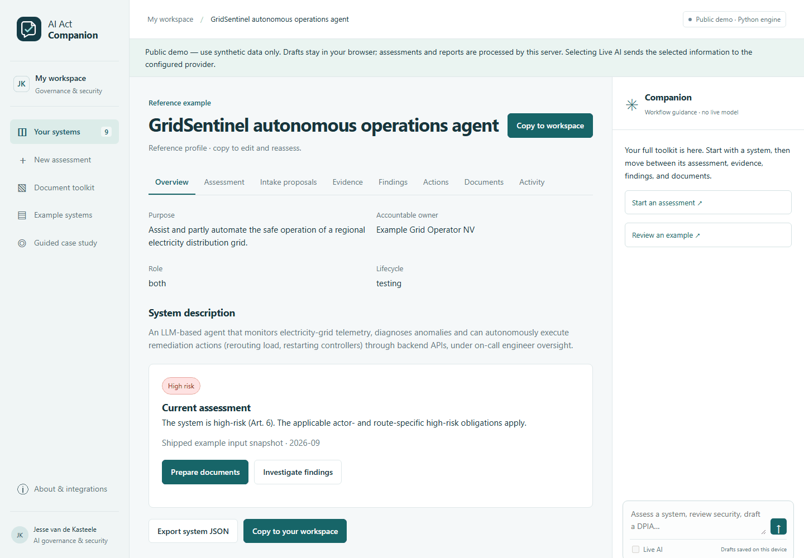

# AI Act Companion

**An evidence-led workspace for AI governance and security.**

**[Open the live demo](https://jessekasteele-ai-act-companion.hf.space/)** ·
[Explore realistic cases](https://jessekasteele-ai-act-companion.hf.space/static/workspace/index.html#examples) ·
[About the app](https://jessekasteele-ai-act-companion.hf.space/static/workspace/index.html#about)



*Real app captures using shipped fictional examples. [System workspace](static/workspace/assets/workspace-overview.png) · [Evidence review](static/workspace/assets/workspace-evidence.png) · [Generated report](static/workspace/assets/workspace-report.png).*

Manage AI systems, complete structured assessments, investigate evidence and
security findings, and prepare documents with Companion alongside your work.
The existing EU AI Act classifier and security toolkit remain the foundation.

Built by Jesse van de Kasteele as a portfolio project connecting AI governance,
data governance, security engineering, and practical agent design.

**1.0 release candidate:** realistic review dossiers, evidence-grounded intake
proposals, follow-up actions, and review packs. [Release scope and remaining review](docs/RELEASE_1_0.md).

## Explore the workspace

The public demo runs this workspace and the Python assessment engine. No account
is required. Drafts stay in your browser; assessment and document requests are
processed by the demo server. Use synthetic data only. Live AI is optional and
depends on the demo's configured provider and available budget.

- **Your systems:** create a draft, import an assessment, or copy one of nine examples.
- **Realistic dossiers:** investigate Meridian Health's member assistant, Boreal
  Water's operations copilot, or Northstar Services' recruitment workflow. Read the
  fictional document packs and start your own working copy.
- **Assessment:** all 13 intake sections, explicit unknowns, automatic draft saving,
  and classification only after complete screening. Edits clear old results.
- **Evidence and findings:** source notes and the original classification and
  architecture-aware security results, organised per system.
- **Documents:** all 21 reports, including DPIA, FRIA, governance, security,
  red teaming and forensic readiness. Preview drafts, download Markdown, print to
  PDF, or export a system with its notes and a CSV inventory.
- **Companion:** workflow guidance without a model, or optional live investigation
  of the selected system and its evidence in a configured local app.
- **Review work:** accept source-linked intake proposals individually, assign
  actions and evidence requirements, record human review notes, and export one
  review pack. Ready for review never means verified or approved.

## Try the guided case

Meridian Health wants to expand a member-service assistant. Its business proposal
says health data never reaches the model; its architecture describes sending
claim details. Proposed write access lacks demonstrated approval enforcement.

1. Compare conflicting passages and inspect their source documents.
2. Record a clarification without treating an assumption as verified evidence.
3. Assign an owner and completion-evidence requirement to each action.
4. Inspect the rule engine's result for the synthetic read-only pilot.
5. Export the evidence, findings, actions, and review history as a Markdown draft.

**Guided mode is a labelled, authored walkthrough, not live AI.** The local app
also supports optional live model investigation through read-only evidence tools
using the existing Ollama or Anthropic provider. Live responses are drafts; they
cannot change the risk tier, close findings, or approve launch.

## Run locally

Requires Python 3.10+. The local app works without a frontend build.

```bash
python -m venv .venv
# Activate: .venv\Scripts\Activate.ps1 (Windows)
#       or source .venv/bin/activate (macOS/Linux)
pip install -e ".[dev,mcp]"
uvicorn app.main:app --reload
```

Open **http://127.0.0.1:8000** for the full workspace. The original intake,
inventory, and report toolkit remains at **http://127.0.0.1:8000/classic**.
On Windows, `scripts/serve-local.ps1` starts a loopback-only server from any directory.

The guided case requires no API key. To use live AI, configure an existing
provider in `.env` using [.env.example](.env.example), then explicitly select
**Live AI** in the workspace. Hosted requests can incur provider charges.
In a working system, **Intake proposals → Ask live AI to read evidence** generates
reviewable suggestions using that configured provider. You can attach UTF-8 text
or Markdown documents; PDF/Word parsing is not included. The static preview offers
authored case proposals and clearly labels them separately from live AI.

## Repository map

| Location | Responsibility |
| --- | --- |
| `static/workspace/` | System workspace, browser engine adapter, optional case walkthrough |
| `app/workspace/` | Shared toolkit dispatcher, validated state, bounded live agent tools |
| `app/` and `app/knowledge/` | Rule engine, governance/security lenses, reports |
| `static/` | Original questionnaire and report interface |
| `mcp_server.py` and `skills/` | Agent access to the existing toolkit through MCP |
| `examples/` and `tests/` | Synthetic assessments and regression/evaluation cases |
| `docs/` | Architecture, reference, deployment, and generated reports |
| `scripts/` | Portable launcher and reproducible demo builds |

## Development checks

```bash
ruff check .
mypy app mcp_server.py
pytest
node --test tests/frontend/*.test.mjs
npm ci
python scripts/build_workspace.py
npm run test:engine
```

The static build requires Node.js 22+ and bundles the original Python engine
through Pyodide. Custom classification and all reports run in a browser worker;
the first operation loads the runtime. It uses no hosted model or API key.
The local app calls Python directly and also lists its previously saved assessments.
Browser drafts stay on your device; this is not a shared case-management service.

## Documentation

- [Documentation index](docs/README.md)
- [Workspace architecture and limitations](docs/WORKSPACE.md)
- [Existing toolkit reference](docs/TOOLKIT.md)
- [Engine design](docs/DESIGN.md)
- [Contributing](CONTRIBUTING.md) · [Security](SECURITY.md) · [Changelog](CHANGELOG.md)

All case materials are synthetic. This is a self-assessment aid, not legal advice
or automated compliance certification. [MIT licensed](LICENSE).
